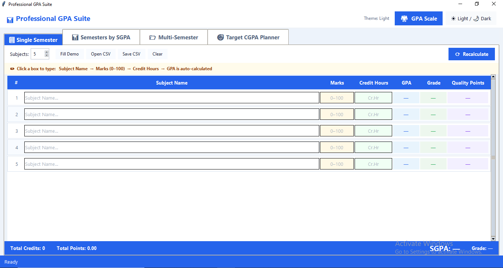
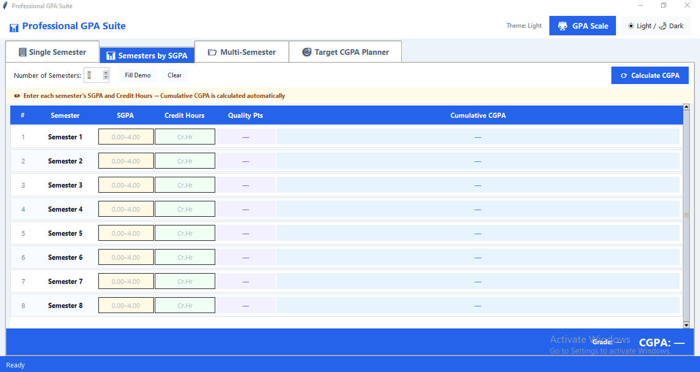
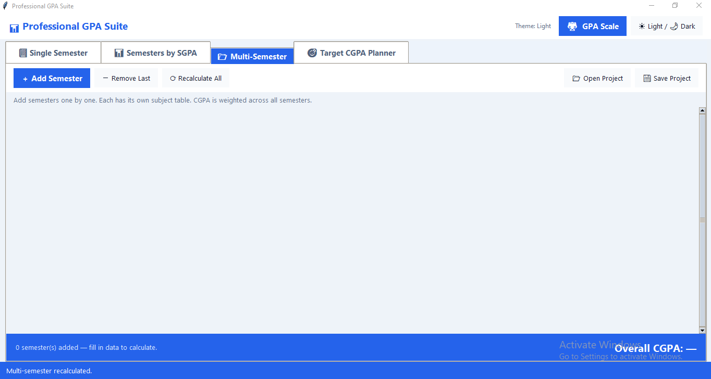
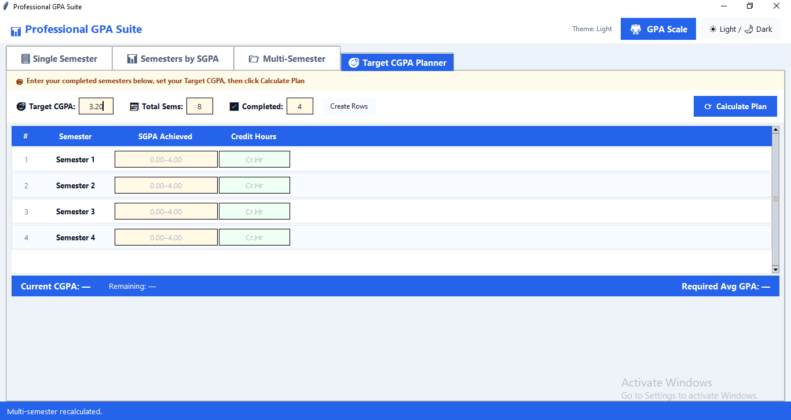
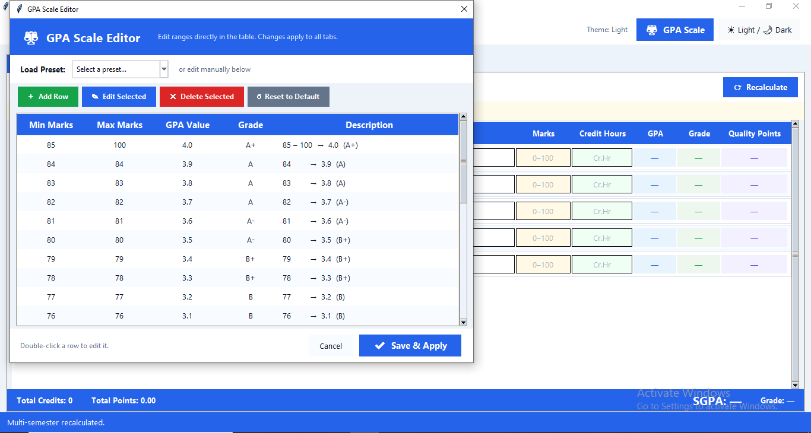

# 🎓 Professional GPA Suite

A feature-rich GPA Calculator desktop application built with Python & Tkinter.


---

## 📸 Screenshots

### 1. Single Semester Calculator



### 2. Semesters by SGPA



### 3. Multi-Semester CGPA



### 4. Target CGPA Planner



### 5. GPA Scale Editor



---

## ✨ Features

- 📊 **Single Semester** — Enter subjects, marks, credit hours → auto GPA
- 📈 **Semesters by SGPA** — Enter SGPA per semester → Cumulative CGPA
- 🗂️ **Multi-Semester** — Full subject-level detail across all semesters
- 🎯 **Target CGPA Planner** — Find required GPA to reach your goal
- ⚙️ **GPA Scale Editor** — Customize grading scale with presets
- 🌙 **3 Themes** — Light, Dark, Blue
- 💾 **CSV Import/Export** — Save and load your data

---

## 🚀 How to Run

### Requirements

- Python 3.8 or higher

### Installation

```bash
# 1. Clone the repository
git clone https://github.com/abubakar-ahmad-ai/GPA-Suite.git

# 2. Go into the folder
cd GPA-Suite

# 3. Install dependencies
pip install -r requirements.txt

# 4. Run the app
python main.py
```

---

## 📁 Project Structure

GPA-Suite/
├── main.py # Entry point
├── core/
│ ├── calculator.py # GPA logic
│ └── gpa_scale.py # Scale management
├── ui/
│ ├── app.py # Main window
│ ├── tabs/ # All 4 tabs
│ ├── widgets/ # Scale editor, semester panel
│ └── theme_manager.py # Theme switching
├── screenshots/ # App screenshots
├── requirements.txt
└── README.md

---

## 👨‍💻 Author

**Abubakar Ahmad**  
GitHub: [@abubakar-ahmad-ai](https://github.com/abubakar-ahmad-ai)
